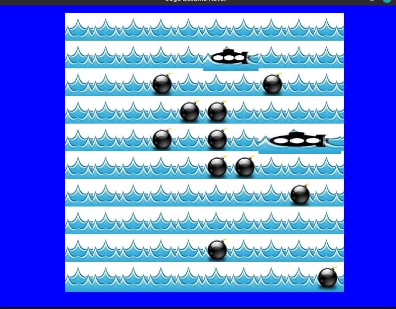

# Batalha Naval com a biblioteca LibGdx
Criadores: Ellem Damarys Silva Mendonça / Izabela Rodrigues de Souza
# Informações do jogo
Batalha naval é um jogo de tabuleiro 10 x 10 onde o jogador tem que adivinhar os quadrados onde os navios estão escondidos. Ganah quado achar os 10 navios.
# Prints do jogo
Menu

Tabuleiro

# Erros a serem concertados
Após concluir todo o processo de desenvolvimento do trabalho, o resultado obtido foi um jogo simples que possui gráficos atraentes. Todavia, O evento de  clique, da classe EventoTela não funciona da forma esperada, as bombas não correspondem totalmente na posição em que o usuário clica para serem postas.

